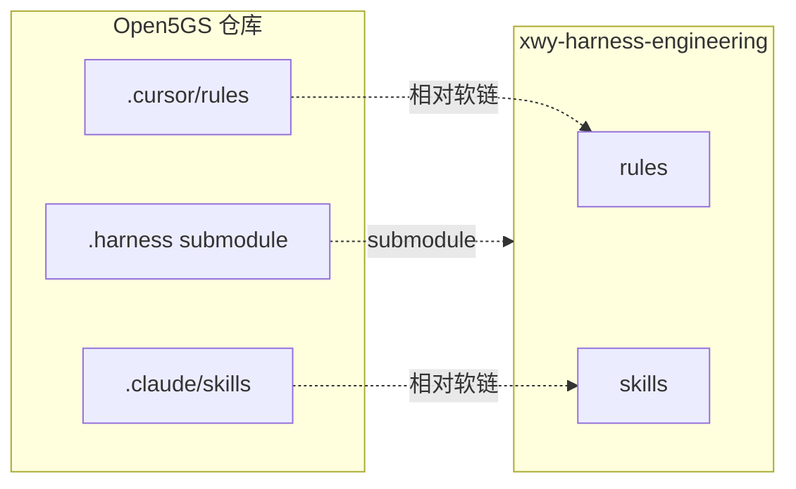
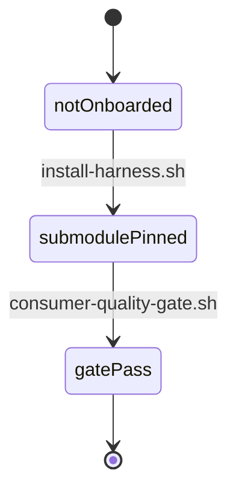

# Plan: Open5GS 接入 xwy-harness-engineering

> 本文档约束 how，即"怎么做"和"为什么这样做"。它解释设计权衡，记录决策。

## 1. 架构概览



## 2. 关键决策（ADR 简版）

### 2.1 决策：采用固定 ref 的 Git submodule 接入

- **背景**：业务仓需复用 harness 且版本可追溯。
- **可选方案**：

  | 方案 | 优点 | 缺点 |
  | --- | --- | --- |
  | submodule | 记录具体 commit；升级走可审查 bump | 需初始化拉取 |
  | 固定版本 copy | 无 submodule 依赖 | 每次升级须人工同步 |
  | CI 动态同步 | 无需本地维护 | 开发机与 CI 易漂移 |

- **决策理由**：submodule 把 `.harness` 固定到审核过的 commit，升级通过一笔可审查 bump；copy 与 CI 动态方式均不可靠。
- **可能的回退方案**：切换到固定版本 copy（`.harness-version` 记录 ref），用于临时验证与调试。

### 2.2 决策：升级固定到 `v0.3.1`，不跟随 master

- **背景**：以 v0.2.0-rc.1 接入后，owner 决定升级到最新 tag 并验证 v0.3.1。
- **可选方案**：

  | 方案 | 优点 | 缺点 |
  | --- | --- | --- |
  | v0.2.0-rc.1 | 接入默认、稳定 | 非最新 |
  | **v0.3.1（采纳）** | 最新 tag，含语料/规则更新 | 需重跑门禁 |

- **决策理由**：v0.3.1 是已打 tag 的最新版本，按 owner 要求升级并验证。
- **可能的回退方案**：切回 v0.2.0-rc.1 固定 commit。

## 3. 标准依据与流程影响

> 关键设计决策不得编造标准依据；缺证据时写入开放问题或风险。

需求分析文档：[`REQUIREMENT_ANALYSIS.md`](REQUIREMENT_ANALYSIS.md)

### 3.1 Evidence 摘要

| Evidence ID | Source | Locator | Type | Plan usage |
| --- | --- | --- | --- | --- |
| EV-001 | onboarding-doc | onboarding/project-onboarding.md | procedure | 决策 2.1 |
| EV-002 | install-script | onboarding/scripts/install-harness.sh | tool | 流程 4.1 |
| EV-003 | quality-gate | scripts/consumer-quality-gate.sh | tool | 验证 8 |

### 3.2 影响矩阵

| Evidence ID | NF / module | Interface | Message / API | Data model | Design impact |
| --- | --- | --- | --- | --- | --- |
| EV-001 | repo-root | submodule | git submodule add | .gitmodules | 新增 .harness 记录 |
| EV-002 | repo-root | cli | install-harness.sh | 软链 | 生成规则链接 |

## 4. 模块划分与职责

| 模块 | 职责 | 主要类型 / 接口 |
| --- | --- | --- |
| `.harness/` | 团队基础设施（只读） | submodule |
| `.cursor/rules/` | Cursor 规则软链 | 相对软链 |
| `.claude/skills/` | Claude 技能软链 | 相对软链 |

## 5. 接口契约

> 内部模块间接口 + 对外工具入口，不把整份契约贴进来。

### 5.1 对外入口

- `install-harness.sh --as-submodule --domain core-network --harness-ref v0.3.1` — 接入入口
- `consumer-quality-gate.sh --repo . --harness-dir .harness --expected-ref v0.3.1` — 门禁

### 5.2 内部接口

```bash
# AGENTS.md 中指向团队资产的相对软链
ln -sfn ../../.harness/rules/global .cursor/rules/global
ln -sfn ../../.harness/rules/stack .cursor/rules/stack
ln -sfn ../../.harness/rules/domain/core-network.mdc .cursor/rules/core-network.mdc
ln -sfn ../.harness/skills .claude/skills
```

## 6. 数据模型

不新增持久化数据模型（无 DB / schema 变更）。

## 7. 状态机 / 时序



## 8. 测试策略

| 层级 | 工具 | 覆盖 |
| --- | --- | --- |
| 单元 | validate-sdd.sh | SPEC/RA/PLAN/TASKS 字段与章节 |
| 集成 | check-sdd-state.sh | 文档交叉引用与生命周期 |
| 门禁 | consumer-quality-gate.sh | pin / sdd / ignore / trace |

每条 Spec AC 必须有对应测试用例（在 `TASKS.md` 中明确）。

## 9. 性能预估

接入为一次性操作，无运行时性能影响。

## 10. 风险与缓解

| 风险 | 等级 | 缓解 |
| --- | --- | --- |
| 代理干扰 git | 低 | 去代理 env 执行 |

## 11. 工期估算

| 阶段 | 工时 | 起止 |
| --- | --- | --- |
| 接入与软链 | 0.5d | 2026-09-04 |
| SDD 资产 | 0.5d | 2026-09-04 |
| 门禁验证 | 0.25d | 2026-09-04 |

## 12. 变更历史

| 版本 | 日期 | 变更 | 作者 |
| --- | --- | --- | --- |
| v0.1 | 2026-09-04 | initial | sder |
