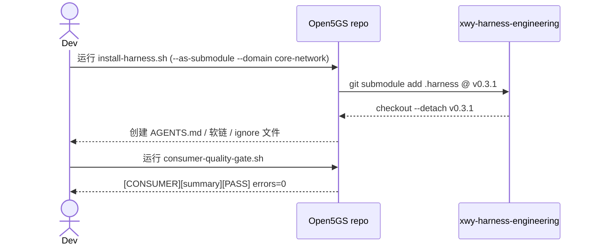

# Spec: Open5GS 业务仓库接入 xwy-harness-engineering

> Spec 是源代码。代码是它的实现。任何代码变更必须能追溯回本文档某一条 AC。

## 1. 为什么（Why）

团队把 `xwy-harness-engineering` 作为 AI 工程脚手架，为 4G/5G 核心网、IMS、OMC 等业务仓库提供统一的 SDD 方法论、团队 Rules、Skills、MCP 与消费仓质量门禁。

- 用户场景：开发者在 Open5GS 仓库里做 5GC/4G 特性，希望直接复用团队的方法论与校验，而不是各自手写。
- 当前痛点 / 触发事件：Open5GS 仓库此前未接入 harness，缺少 SDD 资产、团队 Rules 软链和消费仓质量门禁，AI 工作缺乏统一约束与证据链。
- 不做的后果：业务仓库与团队基础设施脱节，SDD 产出不横向可复用，门禁无法在仓库上落地。

## 2. 目标（Goals）

- G1：以固定 ref（`v0.3.1`）把 `.harness` 作为 Git submodule 装入 Open5GS 仓库。
- G2：生成可跨机器的 Rules / Skills 相对软链、AGENTS.md 入口与三份 ignore 文件。
- G3：创建 `docs/spec/harness-onboarding/` 的 SDD 资产，使消费仓质量门禁返回 PASS。

## 3. 非目标（Non-Goals）

明确**不在**本 Spec 范围内的事，避免 scope creep：

- N1：不交付任何 Open5GS 业务功能改动。
- N2：不跟随 harness `master`（避免未审核变更漂移）；固定到审核过的 tag（当前 `v0.3.1`）。
- N3：不接管业务仓已有的生产配置、客户数据或协议材料。

## 4. 用户故事（User Stories）

按角色组织。必须写明操作主体、动作、价值：

- 作为 **Open5GS 开发者**，我希望 **仓库根目录随取随用团队 Rules/Skills**，以便 **AI 产出遵循团队规范**。
- 作为 **Tech Lead**，我希望 **接入后消费仓门禁能自动校验 SDD 生命周期**，以便 **审计与追溯**。

## 5. 功能与范围（What）

> 用清单 / 表格 / 流程图，不写实现细节。

### 5.1 主流程

### 5.2 功能清单

| ID | 功能 | 优先级 |
| --- | --- | --- |
| F-1 | 以 submodule 固定 `.harness` 到 `v0.3.1` | P0 |
| F-2 | 生成 Rules/Skills 相对软链与 AGENTS.md 入口 | P0 |
| F-3 | 生成 `.cursorignore`/`.codexignore`/`.aiignore` | P0 |
| F-4 | 创建 `docs/spec/harness-onboarding/` SDD 资产 | P0 |

## 6. 约束（Constraints）

- 性能：接入不增加运行时开销；submodule 仅在 checkout 时拉取。
- 兼容性：必须固定到审核过的 ref，不跟随 `master`。
- 安全：ignore 文件须排除客户配置、现网日志、抓包、凭据与未公开协议材料。
- 合规：遵循团队 SDD 方法论与消费仓质量门禁。
- 协议：`core-network` 域；协议相关需求须输出 `REQUIREMENT_ANALYSIS.md`。

## 7. 验收标准（Acceptance Criteria, AC）

> 每一条 AC 必须可测试。"可观察行为"的关键字：返回、显示、记录、生成、拒绝、超时。

- [ ] **AC-1**：执行接入脚本后，`git submodule status` 显示 `.harness` 固定在 `v0.3.1` commit，接入脚本能返回 exit 0。
- [ ] **AC-2**：`.cursor/rules/`、`.claude/skills` 存在指向 `.harness/` 的相对软链，`ls -l` 能显示 `<symlink>`。
- [ ] **AC-3**：`consumer-quality-gate.sh` 对仓库运行后生成 `[CONSUMER][summary][PASS] errors=0` 摘要并记录到输出。
- [ ] **AC-4**：`docs/spec/harness-onboarding/` 下存在非空的 `SPEC.md`，`validate-sdd.sh --all` 拒绝空文档。

### 验证方法

| AC | 验证方式 | 责任人 |
| --- | --- | --- |
| AC-1 | `git submodule status` + install exit code | Dev |
| AC-2 | `ls -l .cursor/rules .claude` | Dev |
| AC-3 | `bash .harness/scripts/consumer-quality-gate.sh --repo . --harness-dir .harness --expected-ref v0.3.1` | Dev |
| AC-4 | `bash .harness/templates/scripts/validate-sdd.sh --all .` | Dev |

## 8. 风险与依赖

| 风险 / 依赖 | 等级 | 缓解策略 |
| --- | --- | --- |
| `.harness` submodule 体积大、含语料/协议数据 | 中 | 仅作 submodule，不复制语料历史 |
| 代理环境变量干扰 git 拉取 | 低 | 接入与门禁命令均去代理 env 执行 |

## 9. 公开问题（Open Questions）

> Spec freeze 前必须全部解决；freeze 后新问题用追加章节记录。

- [ ] Q1：CI 需要把 GitLab 门禁 job 合并进业务仓现有 CI —— Tech Lead 决定在 GitHub CI 上如何落地。—— sder —— due 2026-09-11

## 10. 变更历史

| 版本 | 日期 | 变更 | 作者 |
| --- | --- | --- | --- |
| v0.1 | 2026-09-04 | initial draft | sder |

---

## 写 Spec 的小贴士

1. 一份 Spec 一个主题。多主题就拆。
2. 写完后用 `skills/spec-reviewer` 自检。
3. 试读对象：让一位不熟悉本模块的同事 10 分钟内能复述"做什么、为什么、怎么验"。
4. AC 写完后想：QA 拿到这份 AC，能不能直接写测试用例？不能 → 改。
