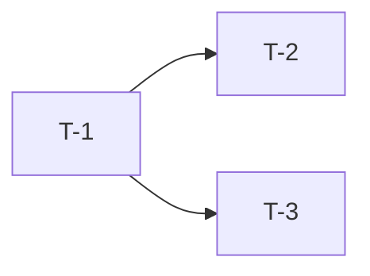

# Tasks: Open5GS 接入 xwy-harness-engineering

> 每个 task 单一职责、粒度小、可独立测试、有完成判据。

## 进度概览

| 状态 | 数量 |
| --- | --- |
| `todo` | 3 |
| `doing` | 0 |
| `done` | 0 |
| `blocked` | 0 |

## 交付策略

- **工作分支**：`codex/harness-onboarding`
- **目标分支**：`master`
- **合并方式**：no_squash（保留每个 task commit）

## Tasks

### T-1：以固定 ref 装入 `.harness` submodule

- **目标**：在仓库根目录以 `v0.3.1` 固定 `.harness`。
- **AC 关联**：实现 SPEC AC-1 / AC-3。
- **输入**：已接入的 harness 工作树与内部 GitLab 可拉取。
- **输出**：`.harness/` submodule 与 `.gitmodules`。
- **完成判据**：
  - [ ] `git submodule status` 显示 `.harness` 固定在 v0.3.1 commit。
  - [ ] `git -C .harness describe --tags --exact-match` 返回 v0.3.1。
- **预估工时**：0.5d
- **责任人**：sder
- **状态**：`todo`

### T-2：生成 Rules / Skills 软链与入口文件

- **目标**：生成 `.cursor/rules/`、`.claude/skills` 相对软链与 AGENTS.md、ignore 文件。
- **AC 关联**：实现 SPEC AC-2。
- **输入**：`.harness` submodule。
- **输出**：软链与入口文件。
- **完成判据**：
  - [ ] `.cursor/rules/global`、`stack`、`core-network.mdc` 与 `.claude/skills` 均指向 `.harness/` 相对路径。
  - [ ] `AGENTS.md`、`.cursorignore`、`.codexignore`、`.aiignore` 存在。
- **预估工时**：0.25d
- **责任人**：sder
- **状态**：`todo`

### T-3：创建 SDD 资产并跑通消费仓门禁

- **目标**：创建 `docs/spec/harness-onboarding/` 四件套并跑通门禁。
- **AC 关联**：实现 SPEC AC-3 / AC-4。
- **输入**：模板与校验脚本。
- **输出**：`SPEC.md`、`REQUIREMENT_ANALYSIS.md`、`PLAN.md`、`TASKS.md`。
- **完成判据**：
  - [ ] `validate-sdd.sh --all` 返回 0。
  - [ ] `check-sdd-state.sh` 返回 0。
  - [ ] `consumer-quality-gate.sh` 输出 `[CONSUMER][summary][PASS] errors=0`。
- **预估工时**：0.5d
- **责任人**：sder
- **状态**：`todo`

## 任务依赖图

## 风险与变更

> 出现 `blocked` 必须在此记录原因与处理。

| 日期 | task | 事件 | 处理 |
| --- | --- | --- | --- |
| YYYY-MM-DD | T-X | 事件 | 处理 |

## 完工总结（done 时填）

- 实际工时：__d
- 偏差原因：
- 最终 MR：
- 合并方式：no_squash
- Task commit map：
  - T-1：
  - T-2：
