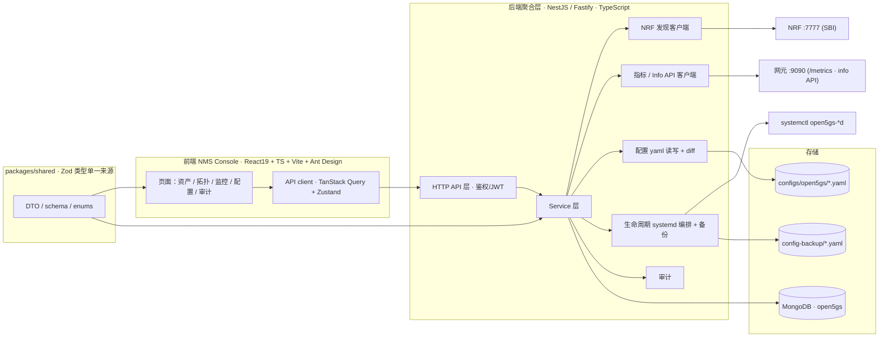
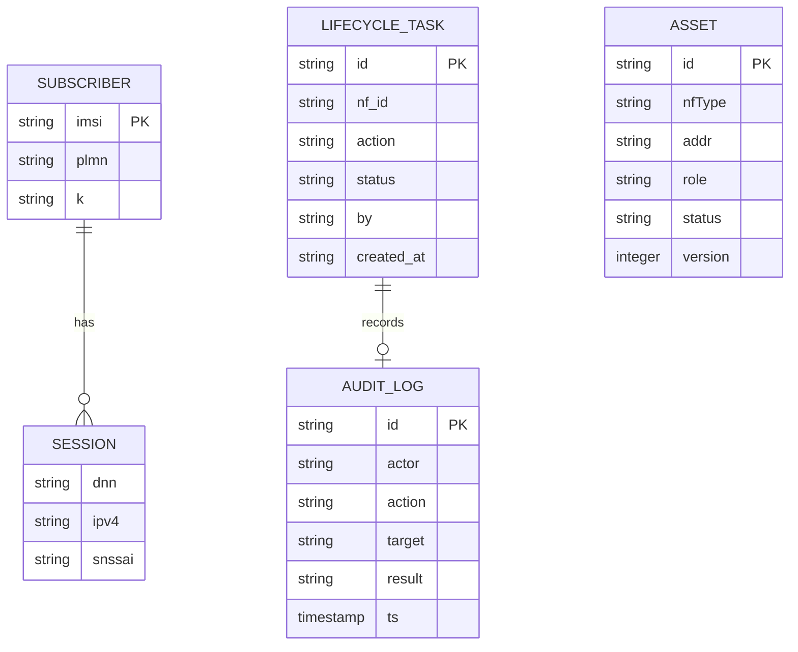
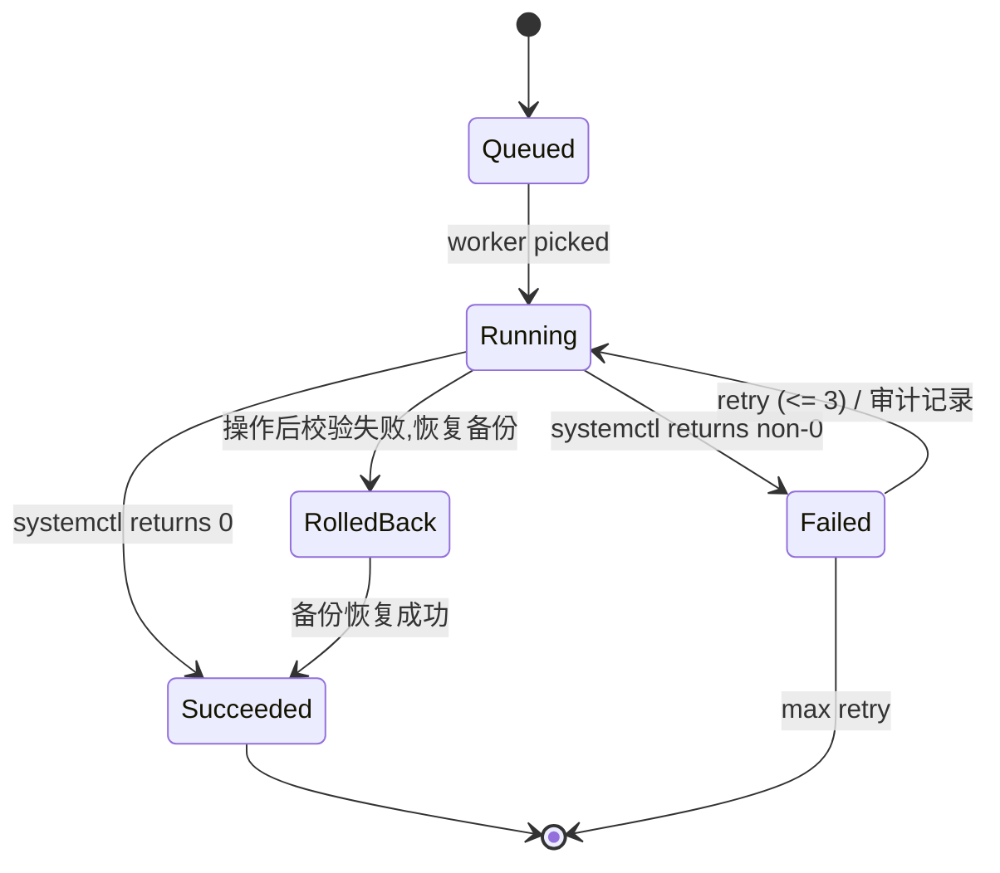

# Plan: NMS Console V1 — 网元资产发现与配置/生命周期管理

> 本文档**约束 how**，即"怎么做"和"为什么这样做"。它解释设计权衡，记录决策。Spec 见 [`SPEC.md`](SPEC.md)，标准证据见 [`REQUIREMENT_ANALYSIS.md`](REQUIREMENT_ANALYSIS.md)。

## 1. 架构概览

采用**前后端分离 + 单一 TypeScript 技术栈**：一个全新的聚合后端（NestJS / Fastify）作为控制面网关，一个全新的 React 19 前端，二者共享 `packages/shared` 的 Zod 类型。控制面对既有 Open5GS 数据源只做"读"与"受控写"，不对核心 C 源码做任何改动。



> 部署：NMS 后端独立端口（如 `5000`），复用 `mongodb://localhost/open5gs`；前端 Vite 开发代理 `/api` 到后端。与现有 `webui/`（Next3/React15）作为不同进程并存，本 Spec 落地后由 NMS 接管其前端职责。

## 2. 关键决策（ADR 简版）

> 每条决策含可选方案、决策理由、Evidence 与回退方案。

### 2.1 决策：后端采用 NestJS 11（TypeScript）+ Fastify 适配器，而非 Go 微服务

- **背景**：这是要**长期生长**的网管平台（即将扩展 监控/拓扑/告警），管理面靠"结构 + 契约 + 模块化"支撑。后端需同时编排 SBI/metrics/配置文件/systemd 与 MongoDB，且与 React 前端共享类型。
- **可选方案**：
  | 方案 | 优点 | 缺点 |
  | --- | --- | --- |
  | **A：NestJS + Fastify 适配器（采纳）** | 生态最大；DI + 模块化，资产/配置/生命周期/监控/拓扑天然成模块；Guard/拦截器/filter 内建；`@nestjs/swagger` 自动出 OpenAPI 3.0 契约；Fastify schema 校验 + 高吞吐 | 比裸 Express/Go 更"重"；冷启动略慢（NMS 可接受） |
  | B：Go（Gin/Echo）独立服务 | 高吞吐/K8s 原生；单二进制 | 开发速度慢；与前端无类型共享；Subscriber CRUD 平移需重写 |
  | C：裸 Fastify/Hono | 轻、快、schema 优先 | 无 DI/模块结构，管理面多模块时缺约束 |
- **决策理由**：网管平台的痛点不是吞吐，而是**多域模块持续叠加 + 契约稳定**；NestJS 模块 + 自动 OpenAPI 是唯一"生态 + 扩展"三得方案。Fastify 适配器补足性能。**决策依据：EV-005（配置/资产来源）、EV-006（systemd）；EV-001/EV-002（SBI 契约）**。与前端同为 TS，`packages/shared` 直接共享类型。
- **可能的回退方案**：若后续吞吐成为唯一瓶颈，把 NRF/指标采集抽成独立 Go worker（队列解耦），HTTP 层仍留在 NestJS。

### 2.2 决策：前端数据层用 TanStack Query + Zustand，而非 Redux

- **背景**：NMS 是**重型服务端状态**应用（资产、配置、指标、生命周期任务），实时性与缓存/refetch 是核心；旧 webui 用 Redux + redux-saga + immutable（React15 时代）。
- **可选方案**：
  | 方案 | 优点 | 缺点 |
  | --- | --- | --- |
  | A：TanStack Query（服务端状态）+ Zustand（客户端状态） | 缓存/去重/自动 refetch 开箱即用；代码量小 | 需要学习 Query 范式 |
  | B：Redux Toolkit + RTK Query | 生态熟、team 可能已有经验 | 样板多；与"服务端 state"模型重叠 |
  | C：纯 SWR | 轻量 | 状态管理/副作用面更散 |
- **决策理由**：NMS 大部分状态是"来自后端的只读/查询数据"，TanStack Query 的缓存与轮询最适合；Zustand 只放登录态/UI 态。**决策依据：EV-003（Info API 分页）、EV-004（metrics 轮询）**。
- **可能的回退方案**：若引入复杂度不够低，可仅用 Zustand + fetch，去掉 Query（牺牲缓存与去重）。

### 2.3 决策：资产主表以本地配置清单为根，NRF 只做"在线叠加"

- **背景**：NRF 只注册"已启动并完成注册"的网元（Chicken-and-egg：未启动的网元永远查不到）；而 `configs/open5gs/*.yaml` 定义了**预期**存在的全部网元。把两者对齐才能给出"哪些网元应该在线、实际是否在线"。
- **可选方案**：
  | 方案 | 优点 | 缺点 |
  | --- | --- | --- |
  | A：本地清单为根 + NRF 在线叠加（采纳） | 离线兜底强；能标记"预期但未注册"网元 | 需维护清单与 NRF 的 ID 对应（通过地址/实例） |
  | B：NRF 为根 | 只反映真实注册 | 未启动网元缺失；无法知道"缺了谁" |
  | C：两者并集，冲突标记 | 覆盖全 | 冲突判定逻辑复杂 |
- **决策理由**：网管首要价值是"清点"+发现异常缺失；A 的离线兜底（AC-8）与"预期 vs 实际"最贴合。**决策依据：EV-001（NRF 发现）、EV-005（配置清单）**。
- **可能的回退方案**：若清单与 NRF 实例映射困难，退回 C（并集 + 差值标记），差值单列一列展示。

### 2.4 决策：生命周期操作走 systemd（child_process + 备份 + 审计），而非 SBI 直管

- **背景**：Open5GS 网元由 `open5gs-*d`（如 `open5gs-amfd`/`open5gs-nrfd`）systemd 服务单元承载（EV-006）；没有任何统一"重启网元"的 SBI。执行重启/重载= `systemctl` 操作，属**有风险南向动作**。
- **可选方案**：
  | 方案 | 优点 | 缺点 |
  | --- | --- | --- |
  | A：systemctl + 操作前配置备份 + 二次确认 + 审计（采纳） | 直接、可控、可回滚；与现有单元机制一致 | 需 node child_process 权限；有真实影响 |
  | B：SBI 优雅控制（如 SMF/AMF 无通用 shut 接口） | 若存在更"协议化" | 各网元不统一，无标准接口；代价高 |
  | C：仅展示命令 + 人工确认 | 零风险 | 未真正"web 化"，价值打折 |
- **决策理由**：A 是唯一能真·web 落地生命周期、且能加"备份/审计/二次确认"防护的路径；SBI 无统一能力（EV-006）。**决策依据：EV-006**。授权边界见 Spec Q2（开发/测试/运维均可，角色 + 二次确认 + 备份 + 审计）。
- **可能的回退方案**：若跨主机管理网元（网元在别的机器/容器），把 systemctl 抽成每节点代理（如 ssh 执行），本计划先覆盖本机。

### 2.5 决策：配置写回用"结构化字段编辑 → yaml 生成"，保留已知 top-level 结构；注释保留列为开放问题 Q3

- **背景**：配置是 OGS 私有 yaml（EV-005），手写片段/注释多见。js-yaml 的 stringify 会丢失注释且可能重排 key。
- **可选方案**：
  | 方案 | 优点 | 缺点 |
  | --- | --- | --- |
  | A：按已知字段编辑 + 生成新 yaml（采纳） | AC-2/AC-3/AC-4 可测；编辑器简单 | 丢失注释/未知字段（Q3 开放，入风险） |
  | B：js-yaml 原样 round-trip | 保留 key 顺序 | 注释必丢；未知结构仍需处理 |
  | C：人工 diff 文本编辑器 + 保存 | 保真 | 无法结构化校验、易错 |
- **决策理由**：V1 覆盖"可结构化建模的字段"（sbi 地址、端口、切片、地址池等），用参数化表单保证 AC；注释/未知字段保真列为 Q3 开放问题并在 §10 风险标注。**决策依据：EV-005**。
- **可能的回退方案**：若用户要求高保真，升级为"yaml 注释感知"解析工具（如 `yaml-cfn`/NL 保真库），列为后续任务。

### 2.6 决策：后端进程去代理访问 loopback（NO_PROXY），并显式清除子进程代理 env

- **背景**：本测试床记忆与基线均确认——存活代理环境变量会破坏 SBI 联通（NRF 502/bad magic）。NMS 后端大量请求 `127.x`/`localhost` 的 SBI/`9090`，且生命周期会 `spawn` systemctl。
- **可选方案**：
  | 方案 | 优点 | 缺点 |
  | --- | --- | --- |
  | A：undici/Node fetch 本地回路走 NO_PROXY，spawn 前清 env（采纳） | 复用真实网络栈、避免脏环境 | 需在启动与请求层显式配置 |
  | B：前端直连 / 绕过后端 | 路径简单 | 违背集中式聚合决策 |
  | C：不处理代理 | 零成本 | SBI 直接 502（已知故障，违反 AC-1） |
- **决策理由**：AC-1（NRF 可达）、AC-6（status 一致）都依赖真实联通；必须显式排除代理。**决策依据：EV-001、EV-005**；引用本机部署约束（proxy 破坏 SBI）。
- **可能的回退方案**：若运行环境无代理，此决策自动降级为 no-op。

### 2.7 决策：pnpm + Turborepo monorepo，`packages/shared` 用 Zod 作为类型单一来源

- **背景**：前后端同属 TS 栈，又要长期生长多个子应用（监控/拓扑/告警可能独立成 app）。类型漂移是最大的长期成本。
- **可选方案**：
  | 方案 | 优点 | 缺点 |
  | --- | --- | --- |
  | **A：pnpm + Turborepo + packages/shared(Zod)（采纳）** | 类型单一来源、`workspace:*` 连接、build 缓存；加字段即全局类型告警；AI 工作流可读可改 | 需 monorepo 纪律（分层、禁循环依赖） |
  | B：独立 repo + OpenAPI codegen 同步类型 | 边界清晰 | codegen 会 drift、需额外步骤；多仓库同步成本高 |
  | C：前后端同 app 不拆 | 部署简单 | 扩展监控/拓扑/告警子应用时无边界 |
- **决策理由**：2026 趋势是"共享 Zod 包 + 框架原生类型推断"，而非 OpenAPI codegen 跑类型（codegen 保留作对外文档）。`packages/shared` 让 FE/BE 引同一份 DTO，**避免两小时同步类型的弯路**。**决策依据：EV-002（数据模型/契约）**。
- **可能的回退方案**：若历史包袱大，退回独立 app + OpenAPI（`@nestjs/swagger` 已能出契约）用 orval 生成客户端。

### 2.8 决策：UI 基座 Ant Design，指标趋势用 ECharts、拓扑用 AntV G6

- **背景**：NMS 是**数据密集型管理台**（密集表格、树、表单、校验；Subscriber/Profile/Account 三 CRUD 需快速落地 AC-13）。可视化分两类：监控趋势图、网络拓扑图。
- **可选方案**：
  | 维度 | 方案 | 决策 |
  | --- | --- | --- |
  | UI 组件 | Ant Design（Table/Form/Tree/ProComponents 开箱即用，中文/CJK 一等，生态最大）vs shadcn/ui（源码可完全拥有、Tailwind 深定制、AI 友好，但无内建数据网格/树） | **Ant Design**（数据密集 CRUD 最快落地） |
  | 趋势图 | ECharts（数据密集、大规模）vs Recharts（轻、React/SSR） | **ECharts**（监控看板数据量大） |
  | 拓扑图 | AntV G6（原生节点+边、Dagre/Force 布局、增量更新）vs ECharts graph（系列之一、难精确布局/部分更新） | **AntV G6** |
- **决策理由**：数据密集 CRUD 用 Ant Design，避免 shadcn 自组大量表格/树/校验的高成本；趋势图用 ECharts 撑数据量；拓扑图用 G6 的**原生图模型**满足动态拓扑（将来 nms-topology 子 Spec 直接复用）。**决策依据：EV-003/EV-004（实时数据量级）、EV-005（资产/拓扑数据）**。
- **可能的回退方案**：若未来需深度品牌自定义/极致身轻，可局部切 shadcn（Ant Design 主体保留），或拓扑改用 Cytoscape.js。

### 2.9 决策：数据层用 `@nestjs/mongoose`（MongoDB ODM），而非 Prisma

- **背景**：数据源是 MongoDB，且核心文档是**层级/非关系型**（`subscribers.slice[].session[]`、`audit_logs`、`lifecycle_tasks`）。F-8 平移沿用同一份订阅数据。
- **可选方案**：
  | 方案 | 优点 | 缺点 |
  | --- | --- | --- |
  | **A：@nestjs/mongoose（采纳）** | 官方 NestJS 集成、装饰器 schema、原生支持嵌套/非关系 JSON；直接复用现有建模 | 序列化 payload 比 Prisma 略重 |
  | B：Prisma (Mongo DB) | 类型强、payload 轻、迁移友好 | 无官方 NestJS 模块（手工集成）；层级 JSON 处理别扭；面向关系型 |
  | C：原生 mongodb driver | 最小依赖 | 无模型/校验/类型，开发慢 |
- **决策理由**：这里数据是**层级 JSON 文档**而非关系型，Mongoose 是"数据决定工具"，不是迁就旧栈；且官方 NestJS 集成最顺。**决策依据：EV-005（订阅数据模型）**。
- **可能的回退方案**：若后期把策略/策略数据改建模成强关系型再评估 Prisma。

## 3. 标准证据与流程影响

需求分析文档：[`REQUIREMENT_ANALYSIS.md`](REQUIREMENT_ANALYSIS.md)

### 3.1 Evidence 摘要

| Evidence ID | Source | Locator | Type | Plan usage |
| --- | --- | --- | --- | --- |
| EV-001 | TS 29.510 | NF Discovery | sbi_api | 决策 2.1/2.3/2.6；`service/nrf` 资产在线叠加 |
| EV-002 | TS 29.571 | Common Data Types | schema | 资产模型公共字段、错误骨架 |
| EV-003 | codebase-kb | 07-infoAPI 教程 | endpoint | `service/metrics` 的 Info API 分页读取，决策 2.2 |
| EV-004 | codebase-kb | 04-metrics 教程 | endpoint | `service/metrics` 的 `:9090/metrics` 快照，决策 2.2 |
| EV-005 | codebase-kb | configs/open5gs/*.yaml + baseline §4 | config | 资产主表与配置读写，决策 2.1/2.3/2.5 |
| EV-006 | codebase-kb | configs/systemd + open5gs-* | procedure | 生命周期 systemctl 编排，决策 2.1/2.4 |

### 3.2 影响矩阵

| Evidence ID | NF / module | Interface | Message / API | Data model | Design impact |
| --- | --- | --- | --- | --- | --- |
| EV-001 | NRF | SBI | `/nnrf-disc/v1/nf-instances` | NF Profile | `GET /api/nfs` 在线状态来源（在线叠加） |
| EV-002 | NMS 后端 | REST | `GET /api/nfs` 响应 | 资产模型 | 统一字段/错误骨架（ProblemDetails 风格） |
| EV-003 | AMF/SMF/MME | `:9090` | `/pdu-info` `/gnb-info` `/ue-info` | JSON+pager | `GET /api/metrics/{nf}/snapshot` 的 info 分支 |
| EV-004 | AMF/SMF/MME | `:9090` | `/metrics` | Prometheus text | `GET /api/metrics/{nf}/snapshot` 的 metrics 分支 |
| EV-005 | 各网元 | config file | `configs/open5gs/*.yaml` | yaml→JSON | `GET/POST /api/nfs/{id}/config` + diff/dry-run |
| EV-006 | 各网元 | systemd | `open5gs-*.service` | unit 状态 | `POST /api/nfs/{id}/lifecycle/*` + `GET .../lifecycle` |

## 4. 模块划分与职责

| 模块 | 职责 | 主要类型 / 接口 |
| --- | --- | --- |
| `apps/server/src/modules/auth` | 登录/JWT 鉴权、角色 Guard、去代理 interceptor | `AuthController`, `JwtAuthGuard`, `RolesGuard` |
| `apps/server/src/modules/asset` | NRF 发现 + 本地清单资产合成、在线叠加 | `AssetController`→`AssetService`（`listNfs`, `loadInventory`） |
| `apps/server/src/modules/config` | yaml 读/编辑/写回/diff、dry-run | `ConfigController`→`ConfigService`（`readConfig`, `applyConfig`） |
| `apps/server/src/modules/lifecycle` | systemctl 编排 + 操作前备份 + 任务队列 | `LifecycleController`→`LifecycleService`（`execAction`, `statusOf`） |
| `apps/server/src/modules/monitor` | `:9090/metrics` 与 Info API 快照 | `MonitorController`→`MonitorService`（`snapshot`, `parseMetrics`） |
| `apps/server/src/modules/topology` | 由 assets + 依赖表 + NRF 生成节点/边 | `TopologyController`→`TopologyService`（`buildTopology`） |
| `apps/server/src/modules/audit` | 写审计日志、任务列表 | `AuditController`→`AuditService`（`record`） |
| `apps/server/src/modules/subscriber` | 平移 Subscriber/Profile/Account 三 CRUD（schema 不变） | `SubscriberModule`, `ProfileModule`, `AccountModule` |
| `apps/server/src/common/` | 去代理/异常过滤器、`@nestjs/swagger` OpenAPI 配置、Mongoose schema | `ProxyFilter`, `OpenApiSetup`, `mongoose schemas` |
| `packages/shared` | Zod DTO/schema/enums 单一来源 | `NfAssetDto`, `ConfigDiffDto`, `LifecycleDto` |
| `apps/web/` | React19 + TS + Vite + Ant Design 前端（五大模块 + 三 CRUD 页） | `pages`, `hooks`, `api` |

> 数据层统一为 Mongoose（决策 2.9）；`@nestjs/swagger` 仅出 OpenAPI 文档供外部消费，类型共享走 `packages/shared`（决策 2.7）。

## 5. 接口契约

> 内部模块间接口 + 对外 API。只列签名，不含完整 payload。

### 5.1 对外 API

- `POST /api/login` — 登录（复用 Account + JWT）
- `GET /api/nfs` — 网元资产清单（本地清单 + NRF 在线叠加）→ AC-1/AC-7/AC-8
- `GET /api/inventory` — 纯本地清单资产模型（离线兜底）→ AC-8
- `GET /api/nfs/{id}/config` — 读取某网元结构化配置 → AC-2
- `POST /api/nfs/{id}/config?dry_run=true|false` — 落盘/仅 diff → AC-3/AC-4
- `GET /api/nfs/{id}/lifecycle` — 服务状态（= systemctl is-active）→ AC-6
- `POST /api/nfs/{id}/lifecycle/{action}` — start/stop/restart/reload → AC-5
- `GET /api/metrics/{nf}/snapshot` — 指标/Info 快照 → AC-11
- `GET /api/topology` — 节点 + 边 → AC-9
- `GET /api/audits` / `GET /api/lifecycle-tasks` — 审计与任务列表 → AC-12

### 5.2 内部接口

```ts
// apps/server/src/modules/asset/asset.service.ts
export async function listNfs(): Promise<NfAsset[]>;
export async function resolveStatus(asset: NfAsset): Promise<'online'|'offline'|'unknown'>;

// apps/server/src/modules/config/config.service.ts
export async function readConfig(id: string): Promise<ConfigDoc>;
export async function applyConfig(id: string, patch: Patch, dryRun: boolean): Promise<DiffResult>;

// apps/server/src/modules/lifecycle/lifecycle.service.ts
export async function execAction(id: string, action: LifecycleAction): Promise<TaskId>;
export async function statusOf(id: string): Promise<LifecycleStatus>;
```
> 对外 API 由 `@nestjs/swagger` 以 `@nestjs/swagger`/DTO 装饰器生成 OpenAPI 3.0 文档（供外部脚本/文档消费）；前端类型经 `packages/shared` 共享（决策 2.7）。

## 6. 数据模型



- `subscribers/profiles/accounts`：沿用现有集合（F-8 平移，**schema 不变**）。
- `lifecycle_tasks`：生命周期异步任务（AC-5 返回 202 + task id）。索引 `(nf_id, created_at)`。
- `audit_logs`：审计记录（AC-12）。索引 `(actor, ts)`。
- 配置文件：`configs/open5gs/*.yaml`（读）/ `config-backup/*.yaml`（写前备份，时间戳后缀）。
- 资产模型：**不落库**，由 inventory + NRF 动态合成（保证与现状一致，避免脏状态）。

## 7. 状态机 / 时序

生命周期操作是异步、可能失败的南向动作，用任务状态机表达（AC-5 的 202 + 状态查询）：



## 8. 测试策略

| 层级 | 工具 | 覆盖 |
| --- | --- | --- |
| 后端单元测试 | NestJS Jest + supertest + mock 外呼 | Service/Guard/Zod pipe、yaml 解析/diff、metrics text 解析、审计/任务序列化 |
| 后端 e2e | `@nestjs/testing` + supertest + mock NRF | `GET/POST /api/nfs`、config dry-run 不落盘、lifecycle 状态一致、审计入库 |
| 前端单元测试 | Vitest + Testing Library | hooks（TanStack Query）、Zod DTO、表单校验 |
| 前端 e2e | Playwright | 登录→主框架、资产/配置/生命周期流、Subscriber CRUD（AC-10/13） |
| 对照验证 | `curl` + `systemctl is-active` | AC-1/AC-6 与真实网元互通 |

**AC 覆盖映射**：AC-1/7/8 → `nrf` + `inventory`（集成）；AC-2/3/4 → `config`（单元+集成）；AC-5/6/12 → `lifecycle`+`audit`（集成）；AC-9 → `topology`；AC-10/13 → Playwright e2e；AC-11 → `metrics`（集成）。

## 9. 性能预估

| 场景 | 期望 | 估算依据 |
| --- | --- | --- |
| `GET /api/nfs` P99 | < 2s | 本地清单瞬间 + NRF 往返（超时 5s，缓存 30s） |
| `GET/POST /api/nfs/{id}/config` P99 | < 1s | 文件读 + yaml 加工 |
| `GET /api/metrics/{nf}/snapshot` | < 1s 单网元 | `:9090` 单抓取 |
| 生命周期并发任务数 | ≤ 10 | 单进程 worker pool 上限 |

## 10. 风险与缓解

| 风险 | 等级 | 缓解 |
| --- | --- | --- |
| 生命周期操作打断运行中网元 | 高 | 二次确认 + dry-run 预览 + 操作前备份 + 审计 + 可回滚（决策 2.4） |
| **Q3 开放**：yaml 注释/未知字段在写回时丢失 | 中 | V1 只编辑可建模字段；注释保真列为后续任务；写回前备份 |
| 聚合层请求被系统代理污染（SBI 502） | 高 | 去代理 + NO_PROXY（决策 2.6），引用本机实测约束 |
| NRF 与本地清单不一致 | 中 | 本地为根 + 差值标记（决策 2.3） |
| 旧 webui 与新控制台进程/端口冲突 | 中 | 独立端口 + 独立依赖树，仅共享 Mongo（EV-005） |
| **Q4 开放**：监控/拓扑子 Spec 是否预留统一端点 | 中 | `/api/metrics/{nf}/snapshot` 即预留，便于 nms-monitor 复用 |

## 11. 工期估算

| 阶段 | 工时 | 起止 |
| --- | --- | --- |
| Tasks 拆解（tasks-breakdown） | 0.5d | D1 |
| 后端聚合层（nrf/inventory/config/metrics/lifecycle/audit + 路由） | 4d | D2–D5 |
| 前端脚手架 + 五大模块 + 三 CRUD 平移 | 4d | D6–D9 |
| 生命周期防护（备份/二次确认/审计） | 1d | D10 |
| 联调 + 集成 + e2e | 2d | D11–D12 |
| 验收（AC 逐条对表 + 门禁） | 0.5d | D13 |

## 12. 变更历史

| 版本 | 日期 | 变更 | 作者 |
| --- | --- | --- | --- |
| v0.1 | 2026-09-04 | initial | sder |
| v0.2 | 2026-09-04 | 技术栈修订：后端 NestJS11+Fastify（非 Node/Express）、数据层 Mongoose（数据驱动）、前端 React19+Vite+Ant Design、pnpm+Turborepo monorepo + packages/shared(Zod)、ECharts+AntV G6；新增 ADR 2.7/2.8/2.9 | sder |
