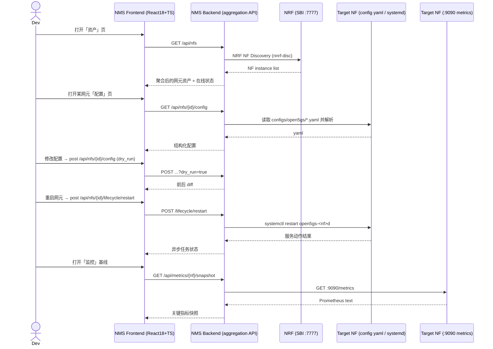

# Spec: 网元资产发现与配置/生命周期管理的 Web 网管控制台（NMS Console V1）

> Spec 是源代码。代码是它的实现。任何代码变更必须能追溯回本文档某一条 AC。

## 1. 为什么（Why）

Open5GS 是一套 5GC + 4G EPC 双模核心网，本测试床同时运行 **16 个网元守护进程**（AMF/SMF/UPF/AUSF/UDM/UDR/PCF/NSSF/BSF/NRF/SCP + MME/HSS/SGW-C/SGW-U/PCRF）。但现有的 [webui](../../../webui/) 只是一个 Next.js 3 / React 15 的老应用，功能只有 Subscriber / Profile / Account 三个 CRUD，**对"网元本身"完全没有视角**——看不到网元清单、在线状态、配置内容，更无法通过 Web 对网元做配置管理或启停。

- 用户场景：开发者 / 调试者在开发测试床上手动登录各网元、`cat`/`vi` yaml 配置、`systemctl` 启停网元、靠 `ps` 和 curl 看状态。操作繁琐、易错、无统一视图。
- 当前痛点 / 触发事件：网元增多后（16 个守护进程），靠记忆和 shell 逐台管理成本高；配置改动无 diff、无审计；无法快速清点网元资产与在线关系。baseline 快照（`docs/study/open5gs-baseline-analysis.md`）确认了这些约束。
- 不做的后果：网管长期停留在"手工 + shell"水平，调测和故障排查效率低，团队新成员上手成本高。

## 2. 目标（Goals）

- G1：提供一份**统一网元资产视图**——通过 NRF 注册发现 + 本地配置清单聚合，让使用者在一张表里看到全部网元的类型、角色、地址、在线/离线、版本。
- G2：提供**网元配置的 Web 化管理**——可视化查看/编辑各网元 yaml 配置，支持 diff 与 dry-run，杜绝"改错不可回滚"。
- G3：提供**网元生命周期操作**——通过 Web 对单个网元执行 启停 / 重载 / 重启，状态可回读。
- G4：完成**前端技术栈现代化**——把老的 Next3/React15 替换为 React18 + TS + Vite + AntD，作为网管控制台的可演进底座。

## 3. 非目标（Non-Goals）

明确**不在**本 Spec 范围内的事，避免 scope creep：

- N1：**不做**深度性能监控仪表盘（多维度图表、告警阈值、时间序列）。V1 只做"**读取**"关键指标快照，完整监控交给后续子 Spec `nms-monitor`。
- N2：**不做**NF 关系拓扑图的复杂可视化（自动布局、交互式画布）。V1 拓扑只做"节点 + 边"的结构化数据输出与简单渲染，深度拓扑交给后续子 Spec `nms-topology`。
- N3：**不做**签约数据模型（Subscriber/Profile）的迁移改造——仅将现有 subscriber/profile/account 三模块的 CRUD **功能平移到新控制台**（新栈重实现，MongoDB schema 与数据模型不变），不做数据清洗或重构。
- N4：**不做**对 Open5GS 核心 C 源码的改动——配置 / 生命周期全部通过既有接口（SBI / yaml / systemd）编排，不改 3GPP 协议栈。
- N5：**不做**多租户、统一认证 SSO、生产级高可用与告警持久化。V1 目标是**开发 / 测试床**用的网管控制台，单实例部署。

## 4. 用户故事（User Stories）

按角色组织。必须写明操作主体、动作、价值：

- 作为 **核心网开发/调试者**，我希望 **打开一个网页就能看到全网元清单与在线状态**，以便 **快速定位哪个网元掉线、哪个网元缺配置**。
- 作为 **运维 / 测试人员**，我希望 **在网页上查看并修改某网元的 yaml 配置、先做 diff 再决定是否生效**，以便 **减少手改配置出错的概率、保留变更痕迹**。
- 作为 **网络管理员**，我希望 **在网页上对指定网元执行 启动/停止/重启/重载**，以便 **不用登录各节点敲 systemctl**。
- 作为 **前端/平台工程师**，我希望 **网管控制台基于现代技术栈且数据源内部化**，以便 **后续扩展监控 / 拓扑 / 告警不推倒重来**。

## 5. 功能与范围（What）

> 用清单 / 表格 / 流程图，**不**写实现细节。

### 5.1 主流程

### 5.2 功能清单

| ID | 功能 | 优先级 |
| --- | --- | --- |
| F-1 | NRF 注册发现 → 网元资产清单（类型/角色/地址/在线/版本） | P0 |
| F-2 | 本地配置清单离线兜底（不依赖 NRF） | P0 |
| F-3 | 网元配置查看 / 编辑 / diff / dry-run | P0 |
| F-4 | 网元生命周期操作（启停 / 重启 / 重载） | P0 |
| F-5 | NF 依赖拓扑的结构化数据（节点 + 边） | P1 |
| F-6 | 关键指标快照读取（为监控子 Spec 打底） | P1 |
| F-7 | 前端脚手架现代化（React18 + TS + Vite + AntD，五大模块框架） | P0 |
| F-8 | 平移现有 Subscriber / Profile / Account 三模块 CRUD 到新控制台（数据模型不变） | P0 |

## 6. 约束（Constraints）

- 性能：资产清单接口 P99 响应 < 2s（含 NRF 往返）；配置 diff 接口 P99 < 1s；NRF 超时阈值 5s。
- 兼容性：新控制台**替换**现有 subscriber webui，成为唯一 Web 前端；Subscriber/Profile/Account 功能**平移**（数据模型与 MongoDB schema 不变）；对 Open5GS 核心源码零改动。
- 安全：登录复用现有账号（Account）体系；生命周期操作（启停/重启）对**开发 / 测试 / 运维**角色均授权（approved Q2），但必须受控——按登录账号角色控制 + 二次确认 + 配置备份 + 审计记录（操作者、动作、对象、时间）。
- 合规：AGPL-3.0（延续仓库 License）；遵循团队 SDD 与消费仓门禁。
- 协议：本特性**不新增协议编解码**，仅消费既有能力——NRF SBI（TS 29.510 NF Discovery）、网元 `:9090/metrics`（Prometheus）、Info API（`/pdu-info` `/gnb-info` `/ue-info` `/enb-info`）、本地 `configs/open5gs/*.yaml`、systemd `open5gs-<nf>d.service`。因涉及 OMC + 南向配置/生命周期，按团队 M-9 须产出 `REQUIREMENT_ANALYSIS.md`。

## 7. 验收标准（Acceptance Criteria, AC）

> 每一条 AC 必须可测试。"可观察行为"的关键字：返回、显示、记录、生成、拒绝、超时。

- [ ] **AC-1**：当后端已配置 NRF 地址且 NRF 可达时，GET `/api/nfs` 应返回 200，并在响应 items 中列出已注册 NF 实例（含 `nfType`、`nfInstanceId`、SBI 地址、在线状态）。
- [ ] **AC-2**：当请求某网元配置时，GET `/api/nfs/{id}/config` 应返回 200 与解析后的结构化 yaml（JSON），字段与 `configs/open5gs/*.yaml` 对应。
- [ ] **AC-3**：当用户提交修改且 `dry_run=true` 时，POST `/api/nfs/{id}/config?dry_run=true` 应**只返回**前后配置 diff 而**不落盘**，返回 200。
- [ ] **AC-4**：当用户提交修改且 `dry_run=false` 时，POST `/api/nfs/{id}/config` 应落盘写入目标配置文件，并返回被修改的 diff 与 200。
- [ ] **AC-5**：当用户点击"重启网元"时，POST `/api/nfs/{id}/lifecycle/restart` 应触发对应 `open5gs-<nf>d` 服务重启，并返回一个异步任务 ID 与 202。
- [ ] **AC-6**：当查询网元生命周期状态时，GET `/api/nfs/{id}/lifecycle` 应返回该网元服务当前状态（active/inactive/failed），与 `systemctl is-active` 一致，返回 200。
- [ ] **AC-7**：当 NRF 不可达时，GET `/api/nfs` 应返回 503 并在响应 body 携带错误原因，前端资产页应显示平台告警提示而非白屏。
- [ ] **AC-8**：当调用 `GET /api/inventory` 仅为本地配置清单解析时，应**不依赖 NRF** 仍能返回网元资产模型（类型/实例/角色/地址），返回 200。
- [ ] **AC-9**：当调用 `GET /api/topology` 时，应返回由 NF 依赖关系生成的节点+边结构化数据（如 AMF→NRF、SMF→UPF、SMF→PCF 等），返回 200。
- [ ] **AC-10**：当用户登录网管控制台后，前端主页面应显示五个导航模块（资产 / 拓扑 / 监控 / 配置 / 导出或审计），且控制台无未捕获 JS 报错。
- [ ] **AC-11**：当调用 `GET /api/metrics/{nf}/snapshot` 时，应返回该网元 `:9090/metrics` 的关键指标快照（非空、可解析），返回 200。
- [ ] **AC-12**：当执行任何生命周期写操作时，后端应记录一条审计日志（操作者、动作、对象、时间、结果），可供前端在审计页展示。
- [ ] **AC-13**：当用户登录新控制台后，Subscriber / Profile / Account 三个页签应可访问，并能完成既有 CRUD（列表 / 新建 / 编辑 / 删除），写操作返回 200 且持久化到 MongoDB。

### 验证方法

| AC | 验证方式 | 责任人 |
| --- | --- | --- |
| AC-1 | 后端集成测试（mock NRF）+ curl | Dev |
| AC-2 | 单元 / 集成测试（yaml 解析） | Dev |
| AC-3 | 集成测试（dry-run 不落盘断言） | Dev |
| AC-4 | 集成测试（落盘 + diff 断言） | Dev |
| AC-5 | 集成测试（restart 触发 + 202 + 任务状态） | Dev |
| AC-6 | 集成测试 + `systemctl is-active` 对照 | Dev |
| AC-7 | 故障注入（NRF 断连）+ 前端错误态 e2e | QA |
| AC-8 | 集成测试（无 NRF 场景） | Dev |
| AC-9 | 集成测试（拓扑数据断言） | Dev |
| AC-10 | 前端 e2e（登录 → 主框架渲染） | QA |
| AC-11 | 集成测试（metrics 抓取解析） | Dev |
| AC-12 | 审计日志单元 + 联调 | Dev |
| AC-13 | 前端 e2e（Subscriber/Profile/Account CRUD）+ Mongo 断言 | QA |

## 8. 风险与依赖

| 风险 / 依赖 | 等级 | 缓解策略 |
| --- | --- | --- |
| NRF 发现与本地清单不一致 | 中 | 以本地清单为资产主表、NRF 提供在线叠加；保留差值标记 |
| 生命周期操作（systemctl）影响运行中网元 | 高 | 增加二次确认 + dry-run 预览；操作前生成配置备份；可回滚 |
| 旧 webui 与新控制台并存导致依赖冲突 | 中 | 新控制台独立 app 与端口，复用 Mongo 连接，不共享依赖树 |
| 网元 `:9090` 未全开启（仅 AMF/SMF/MME） | 低 | 指标快照按可用性降级返回，前端标注"无指标" |
| 配置 yaml 为 OGS 私有格式，跨版本变化 | 中 | 只读解析 + 写回保留原始注释/结构；版本差异列入开放问题 |

## 9. 公开问题（Open Questions）

> Spec freeze 前必须全部解决；freeze 后新问题用追加章节记录。

**已解决（approved 2026-09-04）：**
- Q1（结论：**替换**）——新控制台完全替换现有 webui；Subscriber/Profile/Account 平移到新栈（见 N3 / F-8 / AC-13）。
- Q2（结论：**开发 / 测试 / 运维均可执行生命周期**）——授权范围不限于测试床，受账号角色 + 二次确认 + 备份 + 审计约束（见 §6 安全）。
- Q5（结论：**不拆分**）——合并为单一 nms-console Spec（当前 13 条 AC，仍 <15，未触发强制拆分）。

**仍开放（Spec freeze 前须解决）：**
- [ ] Q3：配置写回时对 yaml 的**注释与手写片段**的保留策略？—— sder —— due 2026-09-18
- [ ] Q4：监控/拓扑两个后续子 Spec 的**数据源接口**是否需要在本期预留（如统一 metrics 聚合端点）？—— sder —— due 2026-09-25

## 10. 变更历史

| 版本 | 日期 | 变更 | 作者 |
| --- | --- | --- | --- |
| v0.1 | 2026-09-04 | initial draft | sder |
| v0.2 | 2026-09-04 | 折入 Q1=替换、Q2=开发/测试/运维均可；新增 F-8 / AC-13；调整 N3/§6 约束与 Open Questions | sder |
