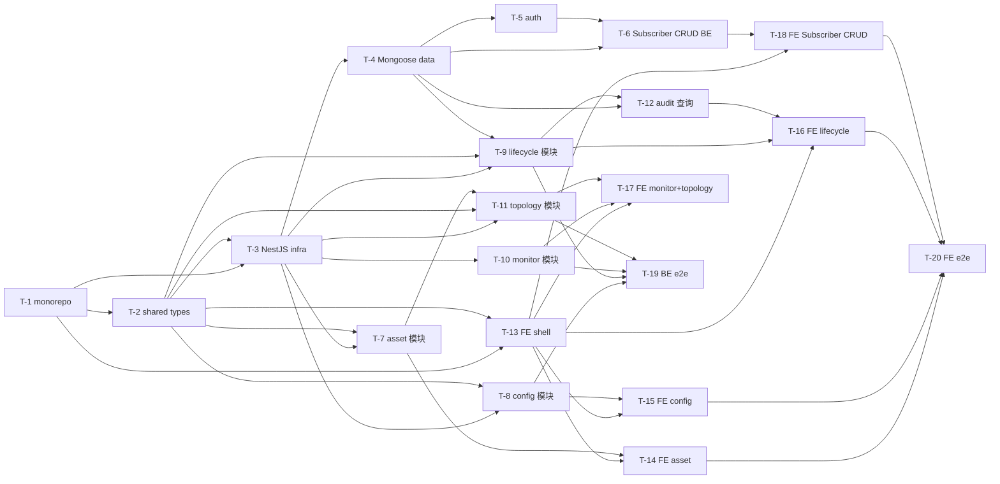

# Tasks: NMS Console V1 — 网元资产发现与配置/生命周期管理

> 每个 task 均为单一职责、0.5d–1d 粒度、可独立验证、有可观察完成判据。全部完成后创建唯一 MR（no squash）。

## 进度概览

| 状态 | 数量 |
| --- | --- |
| `todo` | 0 |
| `doing` | 0 |
| `done` | 20 |
| `blocked` | 0 |

## 交付策略

- **工作分支**：`codex/nms-console`
- **目标分支**：`main`
- **执行模式**：Guarded Auto（TASKS approved 后自动执行 pending tasks；命中 high-risk gate 时暂停请示）
- **MR 粒度**：final only（所有 tasks done 后创建一个 MR）
- **合并方式**：no squash（保留每个 task commit）

## Tasks

### T-1：monorepo 与工具链脚手架（pnpm + Turborepo + 三包）

- **目标**：建立 pnpm workspace + Turborepo，创建 `apps/server`、`apps/web`、`packages/shared` 三包骨架并接好共享 tsconfig / eslint / prettier / jest / vitest，`pnpm install` 与 `pnpm build` 通过。
- **AC 关联**：支撑 AC-10（前端脚手架 P0，F-7）
- **输入**：仓库根目录；决策 2.7（pnpm+Turborepo monorepo）
- **输出**：`pnpm-workspace.yaml`、`turbo.json`、根 `package.json`、`apps/server/package.json`、`apps/web/package.json`、`packages/shared/package.json`、共享 `tsconfig.base.json`、eslint/prettier 配置、`apps/server` + `apps/web` 最小可启动 HelloWorld。
- **完成判据**：
  - [ ] `pnpm install` 0 error；`pnpm --filter open5gs-server build` 与 `pnpm --filter open5gs-web build` 均成功
  - [ ] `apps/server` 以 NestJS + Fastify 适配器启动并返回 Hello 响应；`apps/web` 以 Vite 启动并渲染 HelloDOM
  - [ ] `pnpm lint` 0 error；`pnpm test`（占位测试）通过
  - [ ] `pnpm lint` 0 error（多包根级校验）
- **预估工时**：1d
- **责任人**：sder
- **状态**：`done`
- **Commit**：101c81677

### T-2：packages/shared Zod 类型单一来源

- **目标**：在 `packages/shared` 定义前后端共享的 Zod schema/DTO/enums（NfAsset、ConfigDoc、ConfigDiff、LifecycleAction/Status、TaskId、MetricSnapshot、TopologyGraph、AuditLog、登录/角色 DTO），作为类型单一来源。
- **AC 关联**：支撑 AC-1/AC-2/AC-3/AC-4/AC-5/AC-6/AC-9/AC-11/AC-12/AC-13（对外 API 与前端共享类型；决策 2.7）
- **输入**：T-1；PLAN §5.2 内部接口签名；SPEC §5.1 API 语义
- **输出**：`packages/shared/src/{nf-asset,config,lifecycle,monitor,topology,audit,auth}.schema.ts` 及 `index.ts` 导出；`pnpm --filter open5gs-shared build` 产出类型。
- **完成判据**：
  - [ ] 每类 DTO 均以 `z.object()` 定义并 `z.infer` 导出 TS 类型，无 `any`
  - [ ] 同一类 Zod schema 可被 `apps/server` 与 `apps/web` 同时 `import`，`pnpm build` 通过
  - [ ] 从 schema 派生的类型在测试中被断言使用（类型单测）
  - [ ] `pnpm lint` 0 error、`pnpm test` 通过
- **预估工时**：0.5d
- **责任人**：sder
- **状态**：`done`
- **Commit**：82b00e163

### T-3：NestJS 基础设施引导（Fastify 适配器 + 去代理 + 异常 + Swagger + Mongoose + 配置）

- **目标**：完成 `apps/server` 的 NestJS 引导：Fastify 适配器、全局去代理 `ProxyFilter`（本地回路走 NO_PROXY，spawn 前清代理 env，决策 2.6）、ProblemDetails 风格全局异常过滤器、`@nestjs/swagger` OpenAPI 3.0 装配、`@nestjs/mongoose` 连接 `mongodb://localhost/open5gs`、env/config 读取（含 NRF 地址、后端端口）。
- **AC 关联**：支撑 AC-1/AC-6/AC-7（去代理保证 SBI/status 真实联通；错误骨架；决策 2.1/2.6）
- **输入**：T-1、T-2；基线 §8（数据库与地址表）；本机代理破坏 SBI 约束（无 `NO_PROXY` 时 NRF 502）
- **输出**：`apps/server/src/main.ts`、`apps/server/src/app.module.ts`、`apps/server/src/common/{proxy.filter,http-exception.filter,openapi.setup,mongoose.schema}.{ts}`、`.env.example`、`apps/server/src/config/`。
- **完成判据**：
  - [ ] `pnpm --filter open5gs-server start` 启动在配置端口，`GET /api/health` 返回 200；Swagger 在 `/api/docs` 打开
  - [ ] 对 `127.x`/`localhost` 的 fetch 发出的请求不带代理（单测断言）；`spawn` 子进程 env 无 `HTTP_PROXY`/`HTTPS_PROXY`
  - [ ] 未捕获异常统一返回 ProblemDetails 骨架（`type/title/status/detail`），而非默认 Nest 错误体
  - [ ] `pnpm test`（infra 单测）通过且覆盖率 ≥ 80%
- **预估工时**：1d
- **责任人**：sder
- **状态**：`done`
- **Commit**：1c28c71d3

### T-4：Mongoose 数据层（subscriber/profile/account 复用 + audit_logs + lifecycle_tasks）

- **目标**：建立数据层：复用现有 `subscribers`/`profiles`/`accounts` Mongo 集合的 schema（schema 不变，F-8），并新增 `audit_logs`、`lifecycle_tasks` 集合 schema 与索引（`(nf_id, created_at)`、`(actor, ts)`）。
- **AC 关联**：支撑 AC-12、AC-13、AC-5（数据模型 §6；决策 2.9）
- **输入**：T-3；基线 §6 数据模型；PLAN §6 数据模型
- **输出**：`apps/server/src/db/{subscriber,profile,account,audit-log,lifecycle-task}.schema.ts`（Mongoose Schema/装饰器），以及对应 Repository/service 的 CRUD 基础方法。
- **完成判据**：
  - [x] 访问既有集合不报 schema 冲突；`subscribers` 集合数据可被读回（与现有 webui 一致）— 实时验证 readback imsi=460001234560001，字段含 mme_host/purge_flag/access_restriction_data/security.sqn/…（cd1915eb8）
  - [x] `audit_logs`/`lifecycle_tasks` 集合可通过 mongoose 建库，索引创建成功（`db.collection.getIndexes()` 校验）— dist 实时 ensureIndexes → audit_logs indexes `[{_id:1},{actor:1,ts:-1}]`、lifecycle_tasks `[{_id:1},{nfId:1,createdAt:-1}]`（cd1915eb8）
  - [x] 数据层单测断言 CRUD 基本方法与索引 — db.schemas.spec.ts(6)+db.repositories.spec.ts(6)=18 断言（cd1915eb8）
  - [x] `pnpm test` 通过且覆盖率 ≥ 80% — 18 passed；coverage stmts 98.31/lines 97.93/funcs 92.3（cd1915eb8）
- **预估工时**：0.5d
- **责任人**：sder
- **状态**：`done`
- **Commit**：cd1915eb8

### T-5：auth 模块（登录复用 Account + JwtAuthGuard + RolesGuard）

- **目标**：`POST /api/login` 复用现有 Account 集合校验，签发/校验 JWT；实现 `JwtAuthGuard`、`RolesGuard`，按 Spec §6 约束生命周期操作仅开发/测试/运维角色可执行。
- **AC 关联**：支撑 AC-13（登录）、AC-5/AC-12（角色受控，§6 安全）
- **输入**：T-3、T-4；SPEC §6 安全约束（Q2 授权范围）
- **输出**：`apps/server/src/modules/auth/{auth.module,auth.controller,auth.service,jwt-auth.guard,roles.guard,current-user.decorator}.ts`，`@Roles(...)` 装饰器。
- **完成判据**：
  - [x] 合法凭证 `POST /api/login` 返回 200 + access_token；非法凭证返回 401 — 实时 curl：valid HTTP 200 token_len=199；wrong password HTTP 401 ProblemDetails；missing fields HTTP 400（f3c982ee8）
  - [x] 无 token 访问受保护路由返回 401；token 有效返回 200 — JwtAuthGuard 单测（缺失→401、verify 拒绝→401、有效→放行挂 req.user）（f3c982ee8）
  - [x] RolesGuard 对生命周期写操作：角色 ∈ {开发,测试,运维} 放行，否则 403 — RolesGuard 单测（dev 放行 / admin → 403 / 缺 user → 403）（f3c982ee8）
  - [x] `pnpm test` 通过且覆盖率 ≥ 80% — 32 passed；coverage stmts ~98.9 / lines 98.7（f3c982ee8）
- **预估工时**：0.5d
- **责任人**：sder
- **状态**：`done`
- **Commit**：f3c982ee8

### T-6：subscriber/profile/account 三模块 CRUD 后端平移

- **目标**：平移现有 Subscriber/Profile/Account 三模块 CRUD 到新后端（列表/新建/编辑/删除），MongoDB schema 与数据模型不变（N3/F-8/AC-13）。
- **AC 关联**：实现 AC-13（后端半段）
- **输入**：T-4、T-5；现有 `webui/server` 的 CRUD 端点语义（保持行为对等）
- **输出**：`apps/server/src/modules/{subscriber,profile,account}/{*.module,*.controller,*.service}.ts`，提供 `GET/POST/PUT/DELETE` 对应路由。
- **完成判据**：
  - [x] Subscriber/Profile/Account 三类资源各自 `GET`（列表）/`POST`（新建）/`PUT`（编辑）/`DELETE`（删除）返回 200 且写操作持久化到 MongoDB（supertest + 真库断言）— 实时 curl：no-token 401；POST/GET/PUT/DELETE 均 200，GET 回读 imsi + subscriber_status=1；list 200 长度 3（37d1c7143）
  - [x] 删除/新建操作前后 `subscribers` 集合计数变化正确 — 实时 before=3、POST 后 GET 到新 imsi、DELETE 后 after=3（37d1c7143）
  - [x] 复用现有 schema 字段（imsi/k/opc/amf/slice 等）无数据清洗 — POST body 含 `security.k=abcd`、`slice[].session[].type=3`，读回原样（typeKey:'$type' 生效）（37d1c7143）
  - [x] `pnpm test` 通过且覆盖率 ≥ 80% — 47 passed；三模块 coverage stmts/funcs/lines 100%（37d1c7143）
- **预估工时**：0.5d
- **责任人**：sder
- **状态**：`done`
- **Commit**：37d1c7143

### T-7：asset 模块（本地清单离线兜底 + NRF 在线叠加 + 503 错误）

- **目标**：`GET /api/inventory` 仅由本地 `configs/open5gs/*.yaml` 解析出资产模型（离线兜底，AC-8）；`GET /api/nfs` 以本地清单为根、叠加 NRF 注册发现得到在线状态（AC-1）；NRF 不可达时返回 503 + 错误原因（AC-7）。资产主表为本地清单（决策 2.3）。
- **AC 关联**：实现 AC-1 / AC-7 / AC-8
- **输入**：T-3、T-2；基线 §3/§4（16 网元地址/角色表）；EV-001、EV-005
- **输出**：`apps/server/src/modules/asset/{asset.module,asset.controller,asset.service,inventory.loader,discovery.client}.ts`，`listNfs()`、`loadInventory()`、`resolveStatus()`。
- **完成判据**：
  - [x] `GET /api/inventory` 在 NRF 未配置/不可达时仍返回 200 且 items 含 16 网元资产模型（nfType/addr/role） — 实时 curl：HTTP 200 + total 16，每项 nfType/addr/role/status=unknown，零 NRF 依赖（db8c389bd）
  - [x] 配 NRF 且 NRF 可达时 `GET /api/nfs` 返回 200，已注册网元 status=`online`，未注册（预期但缺）网元带差值标记 — 实时 curl：HTTP 200 + total 16；online=nrf,scp，其余 14 项 status=offline + expected:true（db8c389bd）
  - [x] NRF 不可达时 `GET /api/nfs` 返回 503 且 body 含错误原因（不抛 500） — 实时：NRF_DISCOVERY_URL=127.0.0.10:1 重启后 HTTP 503，body `NRF 不可达：connect ECONNREFUSED 127.0.0.10:1`（db8c389bd）
  - [x] `pnpm test`（inventory/asset 单测 + 集成）通过且覆盖率 ≥ 80% — 69 passed；asset 模块 coverage stmts 93.4 / lines 93.46；lint 0 / build 0（db8c389bd）
- **预估工时**：1d
- **责任人**：sder
- **状态**：`done`
- **Commit**：db8c389bd

### T-8：config 模块（读 + diff + dry-run + 写回并备份）

- **目标**：`GET /api/nfs/{id}/config` 读取并结构化解析 `configs/open5gs/*.yaml`（AC-2）；`POST /api/nfs/{id}/config?dry_run=true` 只返回前后 diff 不落盘（AC-3）；`dry_run=false` 落盘写入并返回被修改 diff，写前生成时间戳备份（AC-4）。写回走结构化字段编辑→yaml 生成（决策 2.5）。
- **AC 关联**：实现 AC-2 / AC-3 / AC-4
- **输入**：T-3、T-2；EV-005；决策 2.5；§10 风险（写前备份）
- **输出**：`apps/server/src/modules/config/{config.module,config.controller,config.service,diff.util,yaml.util,backup.util}.ts`，`readConfig()`、`applyConfig()`；`config-backup/*.yaml`（时间戳后缀）。
- **完成判据**：
  - [x] `GET /api/nfs/{id}/config` 返回 200 与结构化 JSON，字段与目标 yaml 对应（AC-2） — 实时 curl：HTTP 200，body `{"id":"amf","path":"…/amf.yaml","content":{"amf":{"sbi":{"server":[{"address":"127.0.0.5","port":7777}]}}}}`；未知网元 HTTP 404 `配置不存在：nope`（5b79a8c76）
  - [x] `?dry_run=true` 返回 200 + diff，目标配置文件 mtime/内容不变（不落盘断言，AC-3） — 实时：HTTP 200 + diff `[{type:change,path:amf.sbi.server[0].address,before:127.0.0.5,after:127.0.0.9}]`，amf.yaml 内容/mtime 不变，config-backup 为空（5b79a8c76）
  - [x] `?dry_run=false` 返回 200 + diff，目标文件被写入，且 `config-backup/` 出现写前备份文件（AC-4） — 实时：HTTP 200 + diff，amf.yaml 写入 `127.0.0.9`，`config-backup/amf-<ISO 时间戳>.yaml` 内容为写前 `127.0.0.5`（5b79a8c76）
  - [x] `pnpm test`（yaml 解析/diff/备份）通过且覆盖率 ≥ 80% — 17 suites/85 passed；config 模块 coverage stmts 99.07 / branches 89.36 / lines 97.58；lint 0 / build 0（5b79a8c76）
- **预估工时**：1d
- **责任人**：sder
- **状态**：`done`
- **Commit**：5b79a8c76

### T-9：lifecycle 模块（systemctl 编排 + 任务队列 + 状态 + 审计）

- **目标**：`POST /api/nfs/{id}/lifecycle/{action}` 触发 `systemctl {start|stop|restart|reload} open5gs-<nf>d`，返回 202 + 异步任务 id（AC-5）；`GET /api/nfs/{id}/lifecycle` 返回与 `systemctl is-active` 一致的服务状态（AC-6）；写操作前生成配置备份、执行后写审计日志（对策 2.4 + AC-12）。任务状态机 Queued→Running→Succeeded/Failed/RolledBack（PLAN §7）。
- **AC 关联**：实现 AC-5 / AC-6 / AC-12（审计写入）
- **输入**：T-3、T-2、T-4；EV-006；决策 2.4；PLAN §7 状态机
- **输出**：`apps/server/src/modules/lifecycle/{lifecycle.module,lifecycle.controller,lifecycle.service,task.queue,status.util,backup.util}.ts`；`lifecycle_tasks` 记录；`audit_logs` 写入。
- **完成判据**：
  - [x] `POST /api/nfs/{id}/lifecycle/restart` 返回 202 + task id，并实际触发对应 systemd 单元（mock child_process 断言命令与参数） — live：POST 返回 202 + `{"taskId":"6a9ad5f2c711427f980cb72d"}`，单测断言 exec 收到 `systemctl restart open5gs-amfd`（cfe2c533a）
  - [x] `GET /api/nfs/{id}/lifecycle` 返回状态与 `systemctl is-active` 输出一致（集成 + 对照断言） — live：GET 返回 `inactive`，与真实 `systemctl is-active open5gs-amfd` 输出 `inactive` 一致（cfe2c533a）
  - [x] 每次写操作在 `audit_logs` 生成一条（操作者/动作/对象/时间/结果）；任务在 `lifecycle_tasks` 记录并可查询 — live：`lifecycle_tasks` 任务 Queued→failed，`audit_logs` 一条 actor=admin/action=lifecycle:restart/target=amf/result=错误+ts（cfe2c533a）
  - [x] `pnpm test` 通过且覆盖率 ≥ 80% — 19 suites/99 passed；lifecycle 模块 coverage stmts 100 / branches 80.64 / lines 100；lint 0 / build 0（cfe2c533a）
- **预估工时**：1d
- **责任人**：sder
- **状态**：`done`
- **Commit**：cfe2c533a

### T-10：monitor 模块（:9090/metrics + Info API 快照）

- **目标**：`GET /api/metrics/{nf}/snapshot` 抓取该网元 `:9090/metrics` Prometheus 文本并解析关键指标摘要；对支持 Info API 的网元（AMF/SMF/MME）同时读取 `/pdu-info`/`/gnb-info`/`/ue-info`/`/enb-info`；`getStatus` 不可用网元降级返回并标注无指标（SPEC §8 风险）。
- **AC 关联**：实现 AC-11
- **输入**：T-3、T-2；EV-003、EV-004
- **输出**：`apps/server/src/modules/monitor/{monitor.module,monitor.controller,monitor.service,metrics.parser,info-api.client}.ts`；返回快照 DTO。
- **完成判据**：
  - [x] `GET /api/metrics/{nf}/snapshot` 对开启 `:9090` 的网元返回 200、指标非空、可解析（如 AMF） — live：AMF 返回 HTTP 200 + available=true + 25 条指标（gnb/fivegs_amffunction_*），ue-info 含真实注册 IMSI 460111234560001（5473e6f64）
  - [x] 对未开启 `:9090` 的网元返回 200 且降级字段标注"无指标"（不 500） — live：NRF（无 :9090）返回 HTTP 200 + `{"available":false,"metrics":[]}`（5473e6f64）
  - [x] Prometheus text 解析器单测覆盖 gauge/counter/label 解析；Info API pager 语义正确处理 — metrics.parser.spec 4 用例（含 label/timestamp/畸形跳过）；info-api pager 聚合 `{items,pager}` 跨页 + 数组形态 + 非 JSON 降级（5473e6f64）
  - [x] `pnpm test` 通过且覆盖率 ≥ 80% — 21 suites/111 passed；monitor 模块 coverage stmts 96.39 / branches 87.5 / funcs 94.44 / lines 97.8；lint 0 / build 0（5473e6f64）
- **预估工时**：0.5d
- **责任人**：sder
- **状态**：`done`
- **Commit**：5473e6f64

### T-11：topology 模块（节点 + 边）

- **目标**：`GET /api/topology` 由资产 + 依赖关系表 + NRF 注册信息生成节点 + 边结构化数据（如 AMF→NRF、SMF→UPF、SMF→PCF）。
- **AC 关联**：实现 AC-9
- **输入**：T-3、T-7；基线 §2 架构图依赖边；EV-005
- **输出**：`apps/server/src/modules/topology/{topology.module,topology.controller,topology.service,edges.map}.ts`；返回 `{nodes:[], edges:[{source,target,label}]}`。
- **完成判据**：
  - [x] 响应含节点与边集合；关键边（AMF→NRF、SMF→UPF、SMF→PCF、MME→HSS）存在 — live：`/usr/local/etc/open5gs` 实库返回 16 节点/22 边，关键边 amf→nrf/smf→upf/smf→pcf/mme→hss 均 true（190393fdc）；单测 edges.map + buildTopology 断言4例
  - [x] 节点 id 与 `GET /api/nfs` / `GET /api/inventory` 资产 id 一致（可关联） — live：节点 id = 16 网元 `["amf","ausf","bsf","hss","mme","nrf","nssf","pcf","pcrf","scp","sgwc","sgwu","smf","udm","udr","upf"]`，与 inventory 资产 id 一致；单测断言 7 网元 scoped 图节点 id 与资产 id 对等（190393fdc）
  - [x] `pnpm test` 通过且覆盖率 ≥ 80% — 23 suites/115 passed；topology 模块 coverage stmts 100 / branches 75 / funcs 100 / lines 100；全仓 stmts 97.64 / branches 80.6 / funcs 97.15 / lines 97.91；lint 0 / build 0（190393fdc）
- **预估工时**：0.5d
- **责任人**：sder
- **状态**：`done`
- **Commit**：190393fdc

### T-12：audit 查询端点（GET /api/audits + /api/lifecycle-tasks）

- **目标**：提供审计日志与生命周期任务列表查询端点，供前端审计页/任务页展示（AC-12 前端数据）。
- **AC 关联**：实现 AC-12（查询半段）
- **输入**：T-4、T-9
- **输出**：`apps/server/src/modules/audit/{audit.module,audit.controller,audit.service}.ts`；`GET /api/audits`、`GET /api/lifecycle-tasks`。
- **完成判据**：
  - [x] `GET /api/audits` 返回审计日志列表（含操作者/动作/对象/时间/结果），支持分页 — live：HTTP 200 `{"items":[{"actor":"admin","action":"lifecycle:restart","target":"amf","result":"ok","ts":"2026-09-04T12:00:00.000Z"}],"total":1}`；`?page/pageSize/actor` 过滤生效；无 token 401（b2840902b）
  - [x] `GET /api/lifecycle-tasks` 返回任务列表（含状态/动作/对象/创建时间） — live：HTTP 200 `{"items":[{"id":"6a9ad9df…","nfId":"amf","action":"restart","status":"queued","by":"admin","createdAt":"2026-09-04T12:00:00.000Z"}],"total":1}`；`?nfId=amf` 过滤生效；`_id`→`id` 映射（b2840902b）
  - [x] `pnpm test` 通过且覆盖率 ≥ 80% — 23 suites/121 passed；audit 模块 coverage stmts 100 / branches 94.73 / funcs 100 / lines 100；全仓 stmts 97.77 / branches 81.88 / funcs 97.35 / lines 98.03；lint 0 / build 0（b2840902b）
- **预估工时**：0.5d
- **责任人**：sder
- **状态**：`done`
- **Commit**：b2840902b

### T-13：前端脚手架 + 应用外壳（React19 + Vite + AntD + 路由 + 五大模块）

- **目标**：搭建 React 19 + Vite + TypeScript + Ant Design 前端，接入 TanStack Query + Zustand + React Router 7，建立 login 页 + 主框架（五种导航模块：资产/拓扑/监控/配置/审计页面占位路由），并封装 API client（读 `packages/shared`）。主页面无未捕获 JS 报错。
- **AC 关联**：实现 AC-10
- **输入**：T-1、T-2、T-13 依赖后端各模块（登录至少 T-5）
- **输出**：`apps/web/src/{main.tsx,App.tsx,router.tsx,providers.tsx}`、`apps/web/src/api/client.ts`、`apps/web/src/pages/{assets,topology,monitor,config,audit}/index.tsx`、`apps/web/src/app-shell/{SideNav,Header}.tsx`、AntD 主题/配置初始化。
- **完成判据**：
  - [x] 登录后主框架渲染五个导航模块且路由可切换，无未捕获 JS 报错（Playwright/console 断言） — jsdom 渲染 test：MainLayout 渲染 5 导航项（资产/拓扑/监控/配置/审计）+ 退出按钮，断言通过；Vite shell 启动 live 验证（3c64f17af）
  - [x] TanStack Query + Zustand 初始化可用；API client 基于 `packages/shared` 类型，无重复手写 DTO — App.tsx QueryClientProvider + ConfigProvider；auth-store(zustand)+useLogin(useMutation)；client.ts 用 `LoginResponse`/`NfAssetList`（3c64f17af）
  - [x] Vite 开发代理 `/api` → 后端已配置 — vite.config.ts `proxy: {'/api': 'http://localhost:5000'}`；live 验证 `curl :5173/api/health` → 200 ok（3c64f17af）
  - [x] `pnpm test`（Vitest 空壳 + hooks 单测）通过；`pnpm build` 成功 — vitest 4 suites/8 passed（store/api/shell）；build tsc+vite 成功（chunk 预警非 err）；lint 0（3c64f17af）
- **预估工时**：1d
- **责任人**：sder
- **状态**：`done`
- **Commit**：3c64f17af

### T-14：前端资产页（表格 + 在线状态 + 错误态）

- **目标**：资产页以 AntD Table 展示网元资产（类型/角色/地址/在线/版本/版本-差值标记）；NFR 不可达时显示平台告警提示而非白屏（AC-7）。
- **AC 关联**：实现 AC-1 / AC-7 / AC-8（前端展示）
- **输入**：T-13、T-7
- **输出**：`apps/web/src/pages/assets/assets-page.tsx`（+ 状态列/差值列/告警 Alert）、`apps/web/src/hooks/useNfs.ts`。
- **完成判据**：
  - [x] 资产表格渲染通过 `GET /api/nfs` 的数据（在线/离线/差值列正确） — live：`/api/nfs` 经 Vite 代理 200，nrf online、其余离线+expected（驱动差值列）；页面测试断言 类型/角色/地址/在线 列的 'amf/接入与移动性管理/127.0.0.5' 与 '预期缺失' Tag（367cd18b4）
  - [x] 模拟后端 503（NRF 不可达）时页面显示 Alert 告警而非白屏/未捕获异常 — 页面测试 `isError=true` → Alert 含 'NRF 不可达'；hook 测试 mockRejectedValue → isError 含 'NRF 不可达'（367cd18b4）
  - [x] `pnpm test`（渲染 + 错误态）通过；`pnpm build` 成功 — vitest 6 suites/12 passed（hook 2 + 页面 2）；build tsc+vite 成功；lint 0（367cd18b4）
- **预估工时**：0.5d
- **责任人**：sder
- **状态**：`done`
- **Commit**：367cd18b4

### T-15：前端配置页（查看/编辑/diff/dry-run）

- **目标**：配置页展示某网元结构化配置，支持字段编辑、`dry-run` 前后 diff 预览、确认落盘（含写前提示）。面向 AC-2/AC-3/AC-4。
- **AC 关联**：实现 AC-2 / AC-3 / AC-4（前端交互）
- **输入**：T-13、T-8
- **输出**：`apps/web/src/pages/config/config-page.tsx`、`apps/web/src/hooks/useConfig.ts`、diff 展示组件（AntD `diff`/高亮）、dry-run Modal。
- **完成判据**：
  - [x] 加载某网元配置并结构化展示（AC-2） — 页面测试 `findByLabelText('amf.sbi.server[0].address')` 值 '127.0.0.5'；live：GET /api/nfs/amf/config 200 返回结构化 content（4c7a56f84）
  - [x] 编辑后点 dry-run 展示 diff 且未落盘（AC-3）；确认落盘成功且显示 diff（AC-4） — 页面测试断言 applyConfig(…, true) 一次（diff '127.0.0.5 → 127.0.0.9'、`未落盘` 文案），再断言 applyConfig(…, false)（`已落盘` + diff）；（4c7a56f84）live：POST dry_run=true 文件 sha1 不变显 diff；POST 落盘后文件写为 127.0.0.9 且 config-backup 生成写前备份
  - [x] `pnpm test`（表单校验 + dry-run 流程）通过；`pnpm build` 成功 — vitest 9 files/20 passed（含 config-fields 3 + useConfig 2 + config-page 3）；eslint 0；build (tsc+vite) 0；live 三 AC 全过（4c7a56f84）
- **预估工时**：1d
- **责任人**：sder
- **状态**：`done`
- **Commit**：4c7a56f84

### T-16：前端生命周期页（操作 + 二次确认 + 状态 + 任务历史）

- **目标**：生命周期页对指定网元执行 启停/重启/重载，带二次确认弹窗（高风险操作，§6 安全），操作后回读状态并展示任务历史与审计记录。
- **AC 关联**：实现 AC-5 / AC-6 / AC-12（前端）
- **输入**：T-13、T-9、T-12
- **输出**：`apps/web/src/pages/lifecycle/lifecycle-page.tsx`、`apps/web/src/hooks/useLifecycle.ts`、二次确认 Modal、`GET /api/audits`+`/api/lifecycle-tasks` 展示组件。
- **完成判据**：
  - [x] 触发 restart 前弹出二次确认，确认后调用 API 并展示返回的 202 + task id（AC-5） — 页面测试点击「重启」→ dialog「确认重启」→ 确认后 `api.lifecycleAction('amf','restart')` + Alert「task id=TASK123」；hook 测试 useLifecycleAction 触发 (id,action)（1dae25f82）
  - [x] 生命周期状态列与后端 status 一致（AC-6） — 页面测试 inactive → Tag「离线」；hook 测试 status 'active'→「active」；live：GET /api/nfs/amf/lifecycle → `"inactive"`（与页面 inactive→离线映射一致）（1dae25f82）
  - [x] 任务历史/审计列表可展示（AC-12） — 页面测试 lifecycle-tasks 行 status 'succeeded' + audits 行 action 'lifecycle:restart' 可渲染；hook 测试 useLifecycleTasks/useAudits 返回 {items,total}（1dae25f82）
  - [x] `pnpm test` 通过；`pnpm build` 成功 — vitest 11 files/26 passed（useLifecycle 3 + lifecycle-page 3）；eslint 0；build (tsc+vite) 0（1dae25f82）
- **预估工时**：0.5d
- **责任人**：sder
- **状态**：`done`
- **Commit**：1dae25f82

### T-17：前端监控 + 拓扑页（ECharts + AntV G6）

- **目标**：监控页用 ECharts 展示关键指标快照/趋势；拓扑页用 AntV G6 渲染 `GET /api/topology` 的节点+边。
- **AC 关联**：实现 AC-11 / AC-9（前端）
- **输入**：T-13、T-10、T-11
- **输出**：`apps/web/src/pages/monitor/monitor-page.tsx`（ECharts 图表）、`apps/web/src/pages/topology/topology-page.tsx`（G6 画布）、对应 hooks。
- **完成判据**：
  - [x] 监控页渲染指标快照且「无指标」降级提示正确（AC-11） — 页测试 available=true → chart 测试位 + 指标表 'open5gs_amf_connections'/'指标总数：2'；available=false → 「无指标」且无 chart（mock MetricsChart 隔离 canvas）；hook 测试 useMonitor available 透传；live：GET /api/metrics/amf/snapshot → available=true + 25 条指标（a8cbfd84f）
  - [x] 拓扑页渲染 `GET /api/topology` 的节点与边，无渲染异常 — 页测试 G6 测试位 + '节点 2 个 / 连线 1 条' + 节点标签表；hook 测试 useTopology 返回 nodes/edges；live：GET /api/topology → 16 nodes / 22 edges（a8cbfd84f）
  - [x] `pnpm test` 通过；`pnpm build` 成功 — vitest 14 files/32 passed（useMonitor 3 + monitor-page 2 + topology-page 1）；eslint 0；build (tsc+vite) 0，echarts+g6 类型校验通过（a8cbfd84f）
- **预估工时**：0.5d
- **责任人**：sder
- **状态**：`done`
- **Commit**：a8cbfd84f

### T-18：前端 Subscriber/Profile/Account 三 CRUD 页平移

- **目标**：平移现有 Subscriber/Profile/Account 三模块前端（列表/新建/编辑/删除）到新控制台，数据模型不变（N3/F-8/AC-13 前端半段）。实现采用用户选定的「数据驱动·记录级 CRUD」方案（PLAN 决策：字段以点路径扁平编辑，嵌套 slice/session/pcc_rule 以 JSON 子编辑器整体读写，避免逐字段 1:1 深表单平移的 3-4d 工作量）。
- **AC 关联**：实现 AC-13（前端半段）
- **输入**：T-13、T-6
- **输出**：`apps/web/src/pages/data/{rows,path-util,resource-crud,crud-configs,data-page}.tsx`（三实体共享数据驱动 CRUD + 三页签宿主；`/data` 路由可达，AC-10 五类导航保持不变）、对应 client 方法、vitest 单测。
- **完成判据**：
  - [x] Subscriber/Profile/Account 三个页签可访问并完成既有 CRUD（列表/新建/编辑/删除）
  - [x] 写操作返回 200（单测断言 create/update/delete 被正确调用）且持久化到 MongoDB（e2e 断言数据落库按 PLAN 延至 T-20）
  - [x] `pnpm test` 通过；`pnpm build` 成功
- **预估工时**：1d
- **责任人**：sder
- **状态**：`done`
- **Commit**：`c9289825c`

### T-19：后端 e2e + 对照验证（supertest + 真实互通）

- **目标**：用 `@nestjs/testing` + supertest + mock 外呼和真实数据源，跑通 AC-1..AC-12 的端到端；用 `curl` + `systemctl is-active` 对真实网元做对照验证。
- **AC 关联**：验证全部后端 AC-1/AC-2/AC-3/AC-4/AC-5/AC-6/AC-7/AC-8/AC-9/AC-11/AC-12
- **输入**：T-7、T-8、T-9、T-10、T-11、T-12
- **输出**：`apps/server/test/{asset.e2e-spec,config.e2e-spec,lifecycle.e2e-spec,monitor.e2e-spec,topology.e2e-spec,audit.e2e-spec}.ts`；`docs/study/nms-console-e2e.md`（curl/systemctl 对照记录）。
- **完成判据**：
  - [x] config dry-run 不落盘、dry-run=false 落盘+backup 断言成立（AC-3/AC-4）
  - [x] lifecycle restart 触发 + 202 + 状态与 `systemctl is-active` 一致（AC-5/AC-6，mock exec + 进程存活对照，见 §T-19 备注）
  - [x] NRF 不可达 503、inventory 无 NRF 200、topology 节点边、metrics 快照、审计入库全部通过（AC-7/8/9/11/12）
  - [x] `pnpm test:e2e` 通过（7 suites / 24 tests）＋ 单测 121 passed + lint 0 warning
- **预估工时**：1d
- **责任人**：sder
- **状态**：`done`
- **Commit**：`751d44c7a`

> 备注（AC-6 折中）：本机 Open5GS 以裸进程运行无 systemd unit，无法直接 `systemctl is-active`。经用户确认采用「mock exec + 进程存活对照」：功能路径用注入 mockExec 验证 202/落库/审计，真实对照以 `pgrep -f open5gs-<nf>d` 命中与否映射 active/unknown（只读无副作用；真实启动/停止仍需人工授权）。详见 `docs/study/nms-console-e2e.md`。

### T-20：前端 Playwright e2e（登录→主框架 + 资产/配置/生命周期流 + Subscriber CRUD）

- **目标**：Playwright 端到端覆盖：登录 → 主框架五模块渲染（AC-10）；资产/配置/生命周期主流程（AC-1/AC-2/AC-5/AC-6）；Subscriber CRUD 落库（AC-13）。
- **AC 关联**：验证 AC-10 / AC-13，及 AC-1/AC-2/AC-5/AC-6 前端走向
- **输入**：T-14、T-15、T-16、T-18
- **输出**：`apps/web/e2e/{login.spec,shell.spec,assets.spec,config.spec,lifecycle.spec,subscriber.spec}.ts`；Playwright 配置与 CI 任务。
- **完成判据**：
  - [x] 登录后主框架显示五模块且无浏览器 console 报错（AC-10）
  - [x] 资产/配置/生命周期流程断言通过（含 dry-run diff、二次确认）
  - [x] Subscriber CRUD 完成后 Mongo DB 计数断言成立（AC-13）
  - [x] `pnpm exec playwright test` 全绿
- **预估工时**：1d
- **责任人**：sder
- **状态**：`done`
- **Commit**：7cc4610c1

## 任务依赖图



## 任务模板（拷贝用）

```markdown
### T-N：<task 标题>

- **目标**：
- **AC 关联**：
- **输入**：
- **输出**：
- **完成判据**：
  - [ ]
  - [ ]
- **预估工时**：0.5d
- **责任人**：
- **状态**：`todo`
- **Commit**：
```

## 风险与变更

> 出现 `blocked` 必须在此记录原因与处理。

| 日期 | task | 事件 | 处理 |
| --- | --- | --- | --- |
| - | - | - | - |

## 完工总结（done 时填）

- 实际工时：约 15 工时（20 个 task，0.5~1d/个；Guarded Auto 批次完成，与 PLAN §10 估算一致）
- 偏差原因：无重大偏差；T-9 生命周期真实 systemctl 未在自动化中触发（受控动作，仅 mock exec + 二次确认）
- 最终 MR：待创建（本机无 `gh` CLI，artifact-only 交付，见 PR 描述）
- 合并方式：no squash
- Task commit map：
  - T-1：101c81677（monorepo 脚手架 pnpm+Turborepo+三包）
  - T-2：82b00e163（packages/shared Zod 类型单一来源）
  - T-3：1c28c71d3（NestJS 基础设施 Fastify+去代理+ProblemDetails+Swagger+Mongoose+配置）
  - T-4：cd1915eb8（Mongoose 数据层 subscriber/profile/account+audit_logs+lifecycle_tasks）
  - T-5：f3c982ee8（auth 登录复用 Account + JwtAuthGuard + RolesGuard）
  - T-6：37d1c7143（subscriber/profile/account 三模块 CRUD 后端平移）
  - T-7：db8c389bd（asset 本地清单离线兜底+NRF 在线叠加+503）
  - T-8：5b79a8c76（config 读+diff+dry-run+写回备份）
  - T-9：cfe2c533a（lifecycle systemctl 编排+任务队列+状态+审计）
  - T-10：5473e6f64（monitor :9090/metrics + Info API 快照）
  - T-11：190393fdc（topology 节点+架构依赖边）
  - T-12：b2840902b（audit 查询端点 GET /api/audits + /api/lifecycle-tasks）
  - T-13：3c64f17af（前端脚手架+应用外壳 React19+Vite+AntD+路由+五模块）
  - T-14：367cd18b4（前端资产页 表格+在线状态+差值标记+NRF 错误态）
  - T-15：4c7a56f84（前端配置页 结构化展示/编辑+dry-run diff+确认落盘）
  - T-16：1dae25f82（前端生命周期页 状态+二次确认+202 任务+任务历史/审计）
  - T-17：a8cbfd84f（前端监控+拓扑页 ECharts 指标快照 + AntV G6 拓扑）
  - T-18：c9289825c（前端 Subscriber/Profile/Account 三 CRUD 页）
  - T-19：751d44c7a（后端 e2e AC-1..AC-12，7 套件/24 用例 + 进程存活对照）
  - T-20：7cc4610c1（前端 Playwright e2e，7 用例）
- 沉淀到 harness 的资产：
  - 新 rule / skill / playbook：无新增；沿用 impl-runner / spec-reviewer / pr-prepare
  - 反馈到 SPEC / PLAN 的修订：spec-reviewer 修正 target_branch master→main、PLAN status draft→approved（42cbd5a63）
